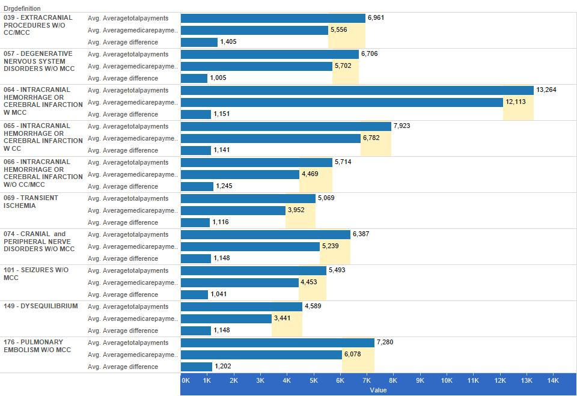

For analysis we are using a database of medical data containing information on the cost of some common medical procedures. 

###Reproducing Our Work:
1. Create a GitHub repository for the project.
2. Create the folders for your project.
3. Find a csv file for statistical comparisons. Our CSV file was found on data.gov. Link: https://data.cms.gov/Medicare/Inpatient-Prospective-Payment-System-IPPS-Provider/97k6-zzx3
4. Import CSV into SQL Developer
5. Follow story instructions to recreate tableau graphs.
5. Build an html file to document these steps.

###Required Packages
```{r, echo=TRUE}
source("../require.R",  echo = TRUE)
```

###Summary and Subset of Main Data
```{r}
source("./summary.R",  echo = TRUE)
```

###Plot #1: Crosstab w/ KPI
Our crosstab examines common medical procedures against the state they're performed in. Data analyzed is the ratio of total payments to the procedure over the total US dollar amount billed to the patient for the procedure. As shown by the table, hospitals are rarely receiving as little as half of their total charges, and most frequently are receving between 20%-40% of their charges. Some states have very low payment ratios across all types of medical procedures, such as California.

Questions Raised by Data:
1. Why do hospitals charge so much in the first place? Is it because they know they will not receive the full payment amount?
2. How are people getting away with not paying medical bills in full?

The KPI uses parameters set in Tableau. The max low KPI is set at .2, while the max medium KPI is set at .4, and anything higher is coded as "high". 


Reproduced in R:
```{r}
source("../03 R SQL Visualizations/Crosstab.R",  echo = TRUE)
```


INCLUDED IS A MORE READABLE IMAGE, SINCE R PRODUCED A CRAPPY ONE:


###Plot #2: Bar Chart with Reference Line
This bar chart compares average out of pocket and medicare payments of different medical precedures.  I added a calculated field of average difference between total payments and medicare payments to see how much on average comes directly out of pocket.  I then added a refrence band to show you exactly where that average difference comes from.  We can see Intracranial Hemorrhage procedures are by far the most expensive but for out of pocket payments its not quite as expensive as Extracranial Procedures. 

Questions Raised by Data:
1. Why are out of pocket expenses for Extracranial Procedures just as expensive as Intracranial Hemorrhage when the total payments reflect differently?
2. Why is the cost so high if so much of the cost is covered from the beginning?




Reproduced in R:


###Plot #3: ScatterPlot
This scatterplot compares the percentile of the average difference (average difference between average total payments and average medicare payments, so out of pocket payments) and total discharges.  There is an interesting set of lines visible from the plot.  They start nearly at the 0th percentile and run to about the 60th percentile.  I honestly don't understand what they could mean.  But the plot also shows an interesting drop just before the 70th percentile and from after that looks just scattered.

Questions Raised by Data:
1. What is with those lines?
2. Why is there the drop off in the percentiles?


```{r}
source("../03 R SQL Visualizations/Scatterplot.R", echo = TRUE)
```


###Plot #4: Blended Data in a Scatter Plot
In our blended dataset, we have a table which contains our original medical data, and a new table which has been inner joined by state. The new table added information such as the number of people on medicare in the state, and the average medical debt per citizen by state. The scatter plot we made compares the number of people on medicare by average total payments. Note: Each vertical column of points represents a number of people in the state. There are many more average total payments points to compare against this one number because there are many different providers which reported different average total payments per state. 

The data shows no distinct correlation between the number of people on medicare in the state and the average total payments by procedure. However, it can be seen with clear distinction that Intracranial hemmorhages have the highest average total payments between the patient and medicare combined, across all states, regardless of how many people are on medicare in the state.

Plot generated in tableau:


Plot generated in R:
```{r}
source("../03 R SQL Visualizations/BlendedScatterplot.R", echo = TRUE)
```
